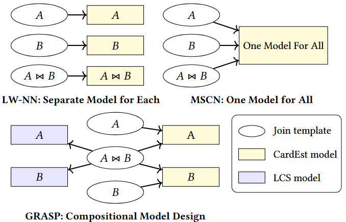
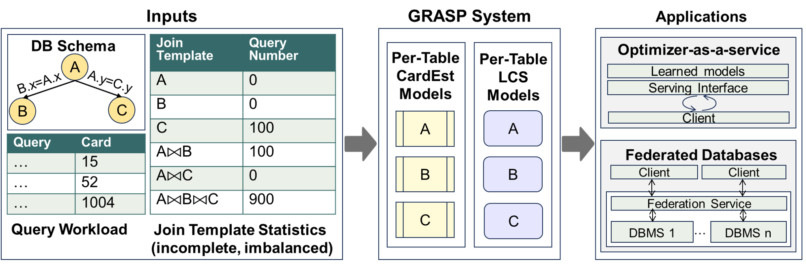

# GRASP Project

   

This is a implementation of the paper: Data-Agnostic Cardinality Learning from Imperfect Workloads. 

This repo contains:

* 🪐 A simplified PyTorch implementation of [GRASP](grasp), containing core functionalities of the GRASP system.
* ⚡️ A PyTorch implementation of [ArCDF](arcdf), improving on prior work [NeuroCDF](https://github.com/shoupzwu/selectivity_generalization).
* 🛸 A self-contained [Python file](train_grasp_ceb.py) for reproducing the main experiments on CEB.
* 🛸 A self-contained [Python file](train_grasp_dsb.py) for reproducing the main experiments on DSB.
* 🛸 A self-contained [Python file](train_grasp_tpce.py) for reproducing the main experiments on TPC-E.
* 🎉A [Python script](query_optimization.py) for running the query end-to-end experiments.

## Preparation
### Dataset/Workloads
1. Download [CEB-IMDb-full (i.e., CEB-IMDb-13k)](https://github.com/learnedsystems/CEB/blob/main/scripts/download_imdb_workload.sh) benchmark, and place the entire directory in your `IMDB_DIRECTORY` in `train_grasp_ceb.py` .
2. The DSB workload is contained in [this repo](queries/dsb.csv)。
3. The TPC-E workload can be downlowned from this [link](https://drive.google.com/file/d/1TnRaOsYUqzE6WEY2Ac0ynw3zTEOl3XjM/view), and please place it in `/queries`.

### Query Optimization
1. Please download and install the modified PostgreSQL from [here](https://github.com/Nathaniel-Han/End-to-End-CardEst-Benchmark/tree/master).
2. Download the IMDb dataset from [here](http://homepages.cwi.nl/~boncz/job/imdb.tgz), and download the populated DSB dataset used in the paper from [here](https://mega.nz/file/iCI2hRhY#96_uiKFvFq0HUcoNNPRnVtMy5BbJ-1QuSry2d3l83xk). 
3. Please load the data into PostgreSQL.

## Usage

### Training GRASP over CEB

To train the GRASP model over CEB, run the following command:

    python train_grasp_ceb.py
    

### Training GRASP over DSB

To train the GRASP model over DSB, run the following command:

    python train_grasp_dsb.py

### Training GRASP over TPC-E

To train the GRASP model over TPC-E, run the following command:

    python train_grasp_tpce.py

## Configuration

The training scripts can be configured by modifying the parameters in the respective `train_grasp_*.py` files. Key parameters include:
- `epoch`: Number of training epochs
- `feature_dim`: Dimension of CardEst models
- `lcs_dim`: dimension of Learned Count Sketch Models
- `bs`: Batch size
- `lr`: Learning rate

## Utilities

The project includes various utility functions and classes located in the `CEB_utlities`, `dsb_utlities` and `tpce_utlities` directories. These utilities are used for data processing and other tasks.

## License

This project is licensed under the MIT License. See the [LICENSE](LICENSE) file for details.

## Contact
If you have any questions, feel free to contact me through email (pagewu@seas.upenn.edu).